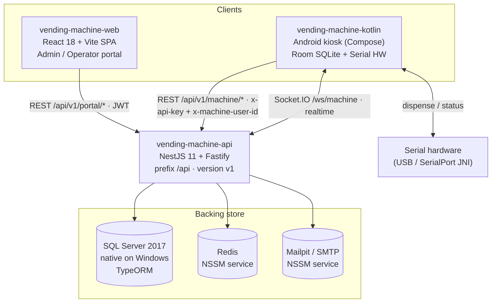
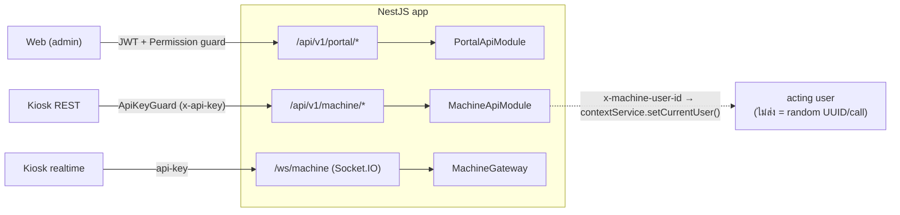
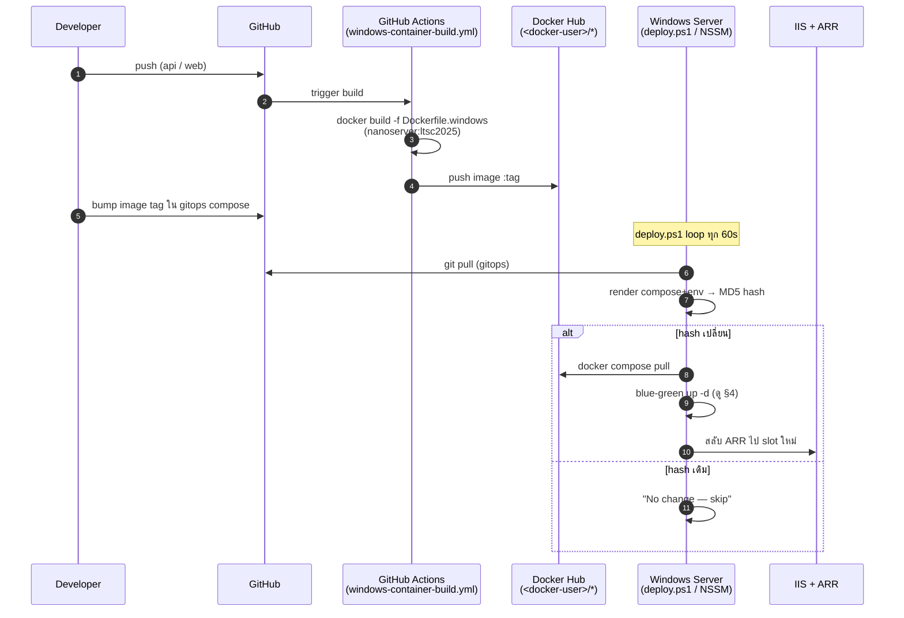
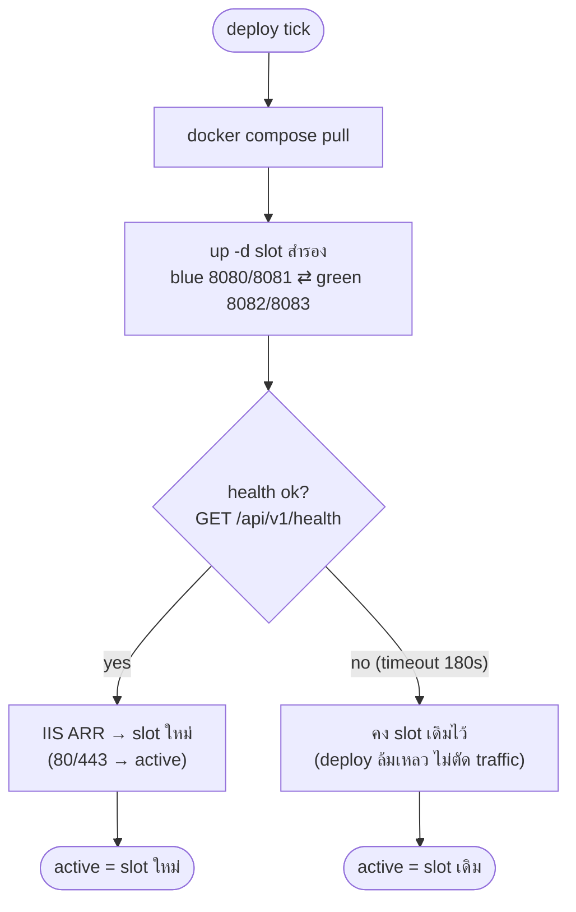
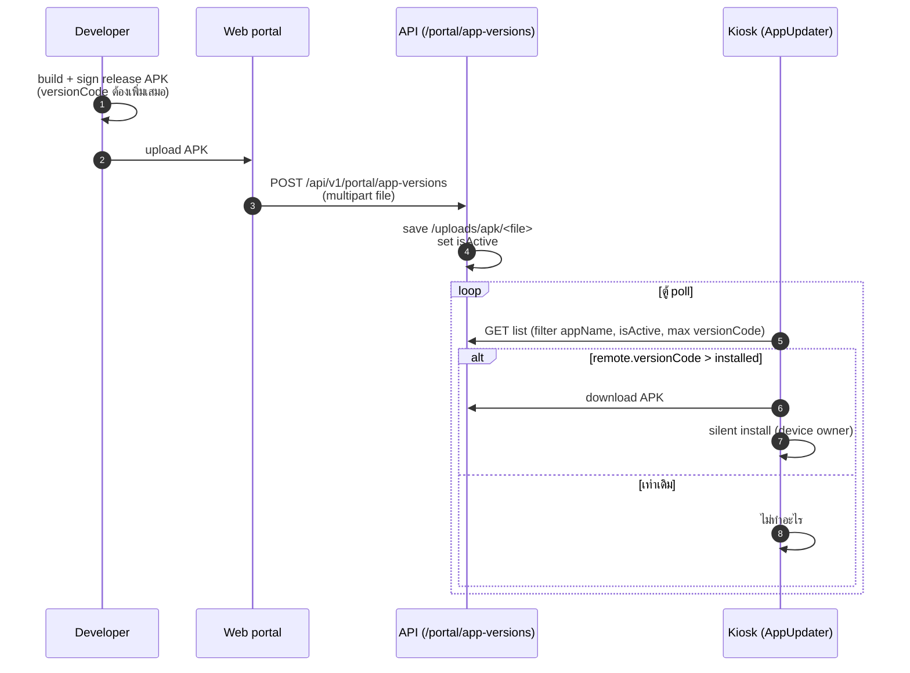
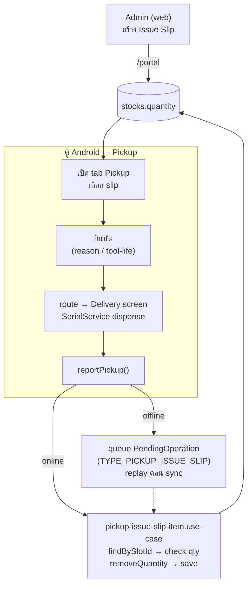
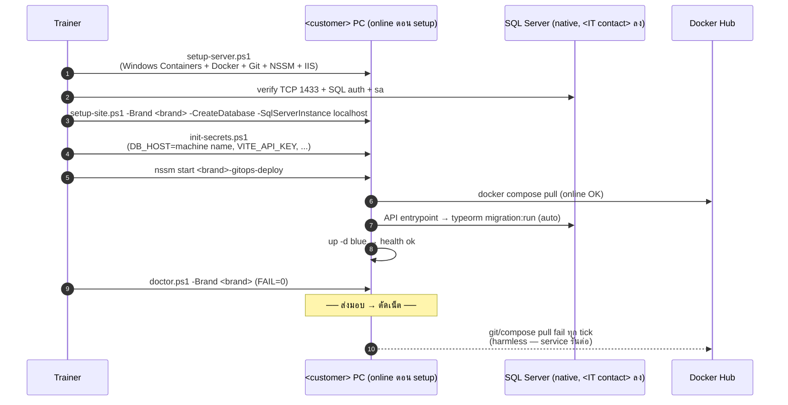

# Architecture & Flow Diagrams (Mermaid)

> Diagram ภาพรวมระบบ vending-machine สำหรับ **Session 3 (architecture + stock)** และ **Session 4 (deploy/OTA)**
> ทุก endpoint / port / behavior verify จาก source จริงแล้ว (ดู [`dev-guidelines/01-system-architecture.md`](dev-guidelines/01-system-architecture.md) สำหรับรายละเอียด)
> Mermaid render ได้ใน GitHub + VSCode (ติดตั้ง *Markdown Preview Mermaid Support* ถ้ายังไม่ขึ้น)

สารบัญ:
1. [System Architecture](#1-system-architecture) — ส่วนประกอบ + ช่องทางคุยกัน
2. [API Routing & Auth](#2-api-routing--auth) — portal vs machine vs socket
3. [GitOps Deploy Pipeline](#3-gitops-deploy-pipeline) — code → kiosk/web ขึ้น production
4. [Blue-Green Deploy](#4-blue-green-deploy-detail) — `deploy.ps1` ทำงานยังไง
5. [Android OTA](#5-android-ota-flow) — ปล่อย APK เวอร์ชันใหม่ให้ตู้
6. [Stock & Pickup Dispense](#6-stock--pickup-dispense-flow) — `stocks.quantity` = source of truth
7. [Offline Bring-up (ลูกค้า offline)](#7-offline-bring-up-ลูกค้า-offline-sequence) — flow วันส่งมอบ (map กับ runbook)

---

## 1. System Architecture

4 ส่วนหลัก คุยกันผ่าน **REST + Socket.IO**, backing store = **SQL Server (native) + Redis**.

- Web **ไม่คุยกับ kiosk ตรง** — ทุกอย่างผ่าน API (remote command → kiosk ส่งผ่าน Socket.IO room)
- Kiosk มี **Room (SQLite local)** เป็น offline store → sync ขึ้น API (ไม่ต่อ SQL Server ตรง)
- prod: SQL Server = **native** (<IT contact> ลงให้), Redis + Mailpit = **NSSM Windows service** (ไม่ใช่ container)

---

## 2. API Routing & Auth

API global prefix `/api`, URI version `v1`, แยก 2 base ผ่าน `RouterModule` + 1 socket namespace.

- `x-machine-user-id` สำคัญ: ApiKeyGuard อ่าน header → set acting user → use case (เช่น pickup) รู้ว่าใครทำ. ถ้าไม่ส่ง → `getCurrentUserId()` คืน UUID สุ่มทุก call → `IssueSlipUnauthorizedPickupException`
- ตัวอย่าง endpoint (verified): `POST /api/v1/portal/app-versions`, `PUT /api/v1/portal/themes/machines/{machineId}`

---

## 3. GitOps Deploy Pipeline

จาก commit → image → ขึ้น production (web/api). **ตู้ Android ไปทาง OTA แยก** (ดู §5).

- **prod = Windows container** (CI build จาก `Dockerfile.windows`). gitops network = `nat` driver
- deploy ทำงานเมื่อ **compose-hash เปลี่ยน** (มาจาก git pull). offline (ลูกค้า <customer> หลังส่งมอบ) → git/pull fail = idle ไม่กระทบ service ที่รันอยู่

---

## 4. Blue-Green Deploy (detail)

`deploy.ps1` ดึง image แล้วขึ้น slot สำรอง, health ผ่านค่อยสลับ — ไม่มี downtime.

- pull fail (offline) ถูก tolerate — `up -d` รันจาก image ที่ load ไว้แล้ว (`$ok` อ่าน exit code ของ `up -d`)
- พังหน้างาน → ดู recovery card ในชุดเอกสาร internal (live-demo-recovery-card)

---

## 5. Android OTA Flow

ปล่อยแอปเวอร์ชันใหม่ → ตู้ดึงเอง. **all-or-nothing ต่อ `appName`** (ไม่มี per-machine target).

- rollback ติดกฎ `versionCode` ต้องเพิ่ม → ลดเวอร์ชันต้อง toggle active + เครื่องที่อัปไปแล้วอาจต้อง `adb` ลดเอง
- DEBUG build ข้าม OTA

---

## 6. Stock & Pickup Dispense Flow

**Source of truth = `stocks.quantity`** (table `stocks`). `slots.current_stock` = denormalized mirror (runtime ไม่เขียน). Issue Slip สร้างจาก **web เท่านั้น** — ตู้แค่ pickup/จ่าย.

- Tool Life บังคับ 1 ชิ้น/รายการ; reason บังคับเมื่อ slip กำหนด
- mock mode (`USE_MOCK=true`, dev เท่านั้น) ข้าม API call แต่ยัง `updateLocalPickedQuantity()`
- รายละเอียด: [`dev-guidelines/06-stock-domain-model.md`](dev-guidelines/06-stock-domain-model.md)

---

## 7. Offline Bring-up (ลูกค้า offline) (sequence)

flow วันส่งมอบหน้างาน — map กับ runbook offline bring-up (ลูกค้า offline) ในชุดเอกสาร internal. Server **มีเน็ตตอน setup**, offline หลังส่งมอบ.

- ไม่ต้อง `docker save`/`load` — pull ตอน online ได้เลย
- `DB_HOST` = **ชื่อเครื่อง / NAT-gateway IP** (host.docker.internal ไม่ resolve) → ดู [`tech-team-handbook.md`](tech-team-handbook.md) §1 (server/native DB wiring)
