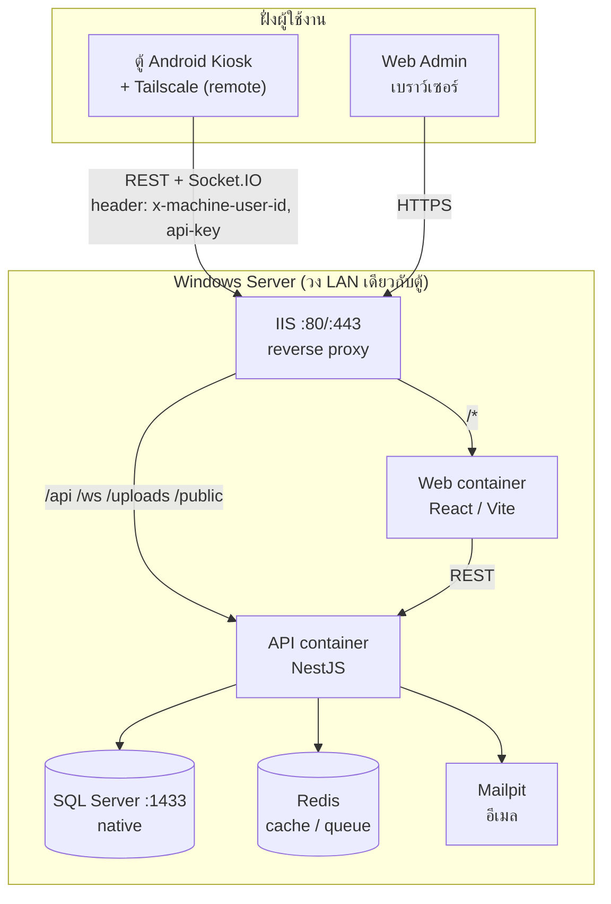
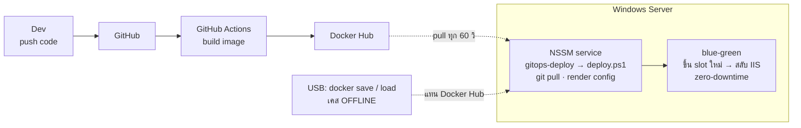
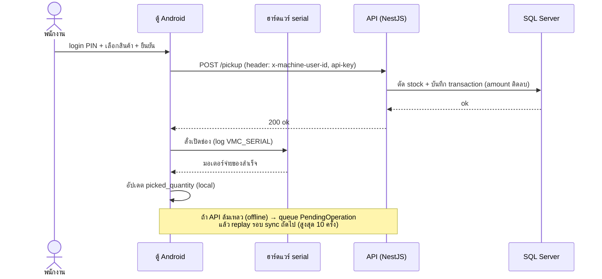

# คู่มือ Training — Setup & Operate ระบบ Vending Machine (สำหรับทีมเทคนิค)

> **เวอร์ชันเอกสาร:** 1.0 — 2026-06-13
> **อ้างอิงระบบ:** Android `0.0.43` (versionCode 49), API = NestJS (node:24), Web = React/Vite, DB = SQL Server 2017 (native บน Windows)
> **ที่มา:** การประชุมวางแผน training (มิ.ย. 2026)

เอกสารนี้สำหรับ **ทีมเทคนิคของลูกค้า** (โปรแกรมเมอร์ + น้องใหม่) ที่จะดูแลระบบ Vending Machine แบบ **Offline** (server local ของลูกค้าเอง) ให้สามารถ **ติดตั้ง / ดูแล / debug / deploy** ได้ด้วยตนเอง — **ไม่ได้สอน coding ลึก** แต่ให้รู้ว่าระบบประกอบด้วยอะไร ใช้เครื่องมืออะไร ข้อมูลวิ่งผ่านช่องทางไหน และต้องทำอะไรเมื่อมีปัญหา

> เอกสารนี้ **คนละเล่ม** กับ `training-plan.md` (อบรม *ผู้ใช้งาน* — พนักงาน/ช่างเติม/Admin) เล่มนั้นสอนการ *ใช้งาน* ระบบ เล่มนี้สอนการ *ดูแลระบบ*

---

## สารบัญ

- [0. ภาพรวมระบบ & การเตรียมตัว](#0-ภาพรวมระบบ--การเตรียมตัว)
- **DAY 20 — On-site (ติดตั้งเครื่องจริง)**
  - [1. Setup Server ใหม่ (Offline)](#1-setup-server-ใหม่-offline)
  - [2. Setup ตู้ Android ใหม่ + Tailscale](#2-setup-ตู้-android-ใหม่--tailscale)
  - [3. Setup ลูกค้า/เครื่องใหม่ (เพิ่ม Machine ในระบบ)](#3-setup-ลูกค้าเครื่องใหม่-เพิ่ม-machine-ในระบบ)
- **DAY 22–23 — Online (Debug / โครงสร้าง / Stock / Deploy)**
  - [4. โครงสร้างระบบ & การ Debug](#4-โครงสร้างระบบ--การ-debug)
  - [5. ข้อมูล & การคำนวณ Stock](#5-ข้อมูล--การคำนวณ-stock)
  - [6. Deploy & Update](#6-deploy--update)
  - [7. Backup, Restore & Maintenance (Day-2 Ops)](#7-backup-restore--maintenance-day-2-ops)
- [ภาคผนวก A — คำสั่งที่ใช้บ่อย](#ภาคผนวก-a--คำสั่งที่ใช้บ่อย)
- [ภาคผนวก B — Troubleshooting รวม](#ภาคผนวก-b--troubleshooting-รวม)
- [ภาคผนวก C — เอกสารอ้างอิง](#ภาคผนวก-c--เอกสารอ้างอิง)
- [ภาคผนวก D — ตารางอบรม (Agenda)](#ภาคผนวก-d--ตารางอบรม-agenda)

---

## 0. ภาพรวมระบบ & การเตรียมตัว

### 0.1 ระบบประกอบด้วยอะไร

ระบบ Vending Machine มี 5 ส่วนหลักที่ต้องเข้าใจ:

| ส่วน | คืออะไร | รันที่ไหน |
|---|---|---|
| **Web (Admin Portal)** | หน้าจัดการ — สินค้า, เครื่อง, สต็อก, ผู้ใช้, รายงาน | Docker container บน Server |
| **API (Backend)** | สมองของระบบ — รับ-ส่งข้อมูลทั้งหมด | Docker container บน Server (NestJS) |
| **Database** | เก็บข้อมูลจริงทั้งหมด | SQL Server บน Windows (native, ไม่ใช่ container) |
| **ตู้ Android (Kiosk)** | หน้าจอหน้าตู้ที่พนักงานกดเบิก | แท็บเล็ต/บอร์ด Android ในตู้ |
| **Updater** | แอป companion สำหรับอัปเดตแอปตู้แบบเงียบ | แอปแยกบนตู้ (`com.ttfts.vendingupdater`) |

เสริม: **Redis** (cache/queue) และ **Mailpit** (อีเมลทดสอบ) เป็น Windows service, **IIS** เป็น reverse proxy หน้าสุด

### 0.2 สถาปัตยกรรม — ข้อมูลวิ่งยังไง

**Runtime — ตอนใช้งานจริง:** ตู้และ Web วิ่งผ่าน IIS เข้า API เท่านั้น แล้ว API คุยกับ DB/Redis/Mailpit



**Deploy — ตอนเอาโค้ดขึ้น:** push → build image → server ดึงมา deploy แบบ blue-green (เคส offline ใช้ USB แทน Docker Hub)



**จุดสำคัญ:**
- ตู้ Android คุยกับ **API** เท่านั้น (ไม่แตะ DB ตรง) ผ่าน 2 ช่องทาง: **REST** (ดึง/ส่งข้อมูล) + **Socket.IO** (real-time push เช่น สั่งเปิดช่อง, อัปเดต config)
- Web ก็คุยกับ API เท่านั้น เช่นกัน → **API เป็นประตูเดียวที่แตะ DB**
- ทุก request จากตู้แนบ header `x-machine-user-id` (ระบุ user ที่กำลังทำรายการ) + `api-key` (ระบุว่าเป็นเครื่องไหน)

### 0.3 บริบท Offline (เคส Denso) — ต่างจาก Cloud ตรงไหน

ลูกค้าต้องการระบบ **offline** — server อยู่ในโรงงานลูกค้า อาจ **ไม่มีอินเทอร์เน็ตออกนอก** ผลกระทบที่ต้องรู้:

| เรื่อง | เคส Cloud (ออนไลน์) | เคส Offline (server ลูกค้า) |
|---|---|---|
| ดึง Docker image | pull จาก Docker Hub อัตโนมัติ | **Denso มีเน็ตตอน setup → `docker compose pull` ได้ปกติ** (USB `docker save`→`load` ไว้เผื่อ air-gap จริงเท่านั้น) |
| Deploy โค้ดใหม่ | GitOps loop (git pull ทุก 60 วิ) | git pull จากเน็ตไม่ได้ → **โหลด image ใหม่ผ่าน USB / git mirror ภายใน** |
| Log → ELK/Kibana | ส่งเข้า ELK กลาง | ELK กลางอาจเข้าไม่ถึง → **พึ่ง log ในเครื่อง** (`C:\logs`, `docker logs`, `adb logcat`) |
| SSL cert ของ API | โดเมนจริง + cert | ใช้ภายใน — อาจเป็น IP/โดเมน local + cert ตัวเอง |
| Remote เข้าไปช่วย | RDP/AnyDesk | **Tailscale** = เส้นเลือดหลัก (เข้าได้ทั้ง server + ตู้ โดยไม่ต้อง port-forward) |

> ⚠️ เพราะ offline ตัด GitHub/Docker Hub ออก **Tailscale จึงสำคัญมาก** — เป็นช่องทางเดียวที่ทีมเราจะ remote เข้าไปช่วย debug / push อัปเดตให้ได้ (ดูหัวข้อ 2.2 และ 2.6)

### 0.4 เตรียมก่อนวันที่ 20

โหลด/ติดตั้งโปรแกรมล่วงหน้า (รายละเอียดเต็มใน `pre-install-checklist.md` และ `customer-pre-install-guide.md`):

- [ ] **เครื่อง Server:** Docker, Git, NSSM, IIS (+ URL Rewrite + ARR), SQL Server
- [ ] **เครื่อง Programmer:** Git, Node 24, pnpm, VS Code, Docker Desktop, Android Studio **ขั้นต่ำ Ladybug 2024.2.1** (แนะนำ Narwhal 2025.1.1+ เพราะ compileSdk 36) (+ AVD `vmkiosk` 1080×1920@160dpi), SSMS, Postman, scrcpy
- [ ] **ตู้ Android:** **Android ขั้นต่ำ 7.0** (minSdk 24), เปิด Developer Options + USB Debugging, เตรียมสาย USB (ส่งข้อมูลได้)
- [ ] ฝั่งลูกค้าส่ง **remote access เข้า server** มาให้ทีมเช็กล่วงหน้า
- [ ] ทีมเตรียม **USB** ที่มี Docker images (`docker save`) + APK + ตัวติดตั้ง (เผื่อ server ไม่มีเน็ต)
- [ ] confirm กับ IT ลูกค้า: server ลง SQL Server / database ให้หรือยัง

**Docker images ที่ต้องมี** — มีแค่ **2 ตัว** (api + web): `<registry>/vending-machine-api:<tag>`, `<registry>/vending-machine-web:<tag>`
> SQL Server = native (host), Redis + Mailpit = NSSM service → **ไม่ใช่ container** จึงไม่ต้องเตรียม image. Denso มีเน็ตตอน setup → `docker compose pull` เอาเองได้ (USB `docker save` ไว้เผื่อ air-gap เท่านั้น)

### 0.5 ศัพท์ที่จะเจอบ่อย

| คำ | ความหมาย |
|---|---|
| **GitOps / deploy.ps1** | สคริปต์ที่ดึงโค้ด+render config+deploy อัตโนมัติ รันเป็น NSSM service |
| **Blue-Green** | deploy ขึ้น slot ใหม่ (สีน้ำเงิน↔เขียว) แล้วสลับ → ไม่มี downtime |
| **NSSM** | ตัวห่อโปรแกรมให้เป็น Windows Service |
| **ARR** | โมดูล IIS ที่ทำ reverse proxy |
| **Device Owner** | สิทธิ์สูงสุดบน Android → lock เป็น kiosk + silent install |
| **api-key** | กุญแจประจำเครื่องตู้ (สร้างตอนเพิ่ม Machine ในเว็บ) |
| **Slot / slot_products** | ช่องในตู้ + ตารางเก็บสต็อกต่อช่อง |

---

# DAY 20 — On-site (ติดตั้งเครื่องจริง)

> เป้าหมายวันนี้: ทำให้ **server ขึ้นครบ** + **ตู้ 1 เครื่องใช้งานได้จริง** (เครื่องนี้จะเอาไปใช้ที่ Denso ต่อ) — เน้น *ทำตามจริง* ทีละขั้น

---

## 1. Setup Server ใหม่ (Offline)

> รายละเอียดเต็ม + troubleshooting อยู่ใน **`server-setup-guide.md`** (กรณี A = server ใหม่, กรณี B = เพิ่ม site) — ส่วนนี้สรุป flow + จุดที่ต่างสำหรับ offline
>
> 🏃 **กดตามวันจริง (เช็กลิสต์ทีละ step):** [`site-setup-runsheet.md`](site-setup-runsheet.md) — เปิดคู่กับหัวข้อนี้

### 1.0 สคริปต์อัตโนมัติ (ทางลัด — ลองตัวนี้ก่อน manual)

repo `vending-machine-gitops` มีสคริปต์ครอบงาน setup ทั้งหมด — ขั้นตอน manual (1.1–1.3) ไว้ "เข้าใจระบบ + กู้ตอนสคริปต์พัง"

| สคริปต์ | ทำอะไร | ใช้เมื่อ |
|---|---|---|
| `setup-server.ps1` | กรณี A: Docker + Git + NSSM + IIS/ARR (ยกเว้น SQL Server) | server ใหม่ ครั้งเดียว |
| `setup-windows-services.ps1` | ลง Redis + Mailpit (เป็น NSSM service) | server ใหม่ ครั้งเดียว |
| `init-secrets.ps1` | สร้าง `.env.secrets` แบบ interactive (gen JWT ให้, มาสก์ค่า, มี guideline ทุกฟิลด์) | ก่อนสร้าง site |
| **`setup-site.ps1`** | **กรณี B ทั้งก้อน:** clone + secret stubs + dirs + IIS site/pool + NSSM deploy service + DB (optional) — **idempotent รันซ้ำได้** | ลูกค้า/เครื่องใหม่ |
| `doctor.ps1` | health check แบบอ่านอย่างเดียว (server + per-brand), exit 0=ผ่าน 1=มี FAIL | หลัง setup / ทุกครั้งที่สงสัย |
| `deploy.ps1` | loop deploy (git pull → render compose → blue-green) | รันเป็น NSSM service auto |
| `setup-observability-services.ps1` | ส่ง log เข้า ELK | **offline ข้ามได้** |

**Fast path — server ใหม่ + ลูกค้าแรก:**

```powershell
# ── Bootstrap (กรณี A, ครั้งแรกของเครื่อง): fresh server ยังไม่มี git/pwsh ──
# เอา setup-server.ps1 เข้า C:\ ก่อน (มันเป็น script เดี่ยว standalone):
#   ทางหลัก: TeamViewer → "ไฟล์ & ส่วนเพิ่มเติม" → ส่งไฟล์ setup-server.ps1 ไป C:\
#   ทางสำรอง (repo public): iwr <gitops-raw-url>/setup-server.ps1 -OutFile C:\setup-server.ps1
powershell -ExecutionPolicy Bypass -File C:\setup-server.ps1   # PS 5.1! (pwsh ยังไม่มี) reboot+รันซ้ำถ้าแจ้ง REBOOT REQUIRED

# ── มี git+pwsh+Docker+NSSM+IIS แล้ว → clone repo จริง + ที่เหลือ ──
# repo private: ฝัง PAT (scope repo) — ดู "Git auth" §1.2.  <gitops-repo-url> = host/path (เช่น github.com/.../vending-machine-gitops.git ไม่ใส่ https://)
# repo public: ตัด <PAT>@ ออก → git clone https://<gitops-repo-url> C:\gitops-bootstrap
git clone https://<PAT>@<gitops-repo-url> C:\gitops-bootstrap
cd C:\gitops-bootstrap
pwsh -File .\setup-windows-services.ps1 -RedisPassword "<รหัส>"   # Redis + Mailpit (NSSM)

# ── ทุกลูกค้า/เครื่องใหม่ (กรณี B) ──
pwsh -File .\init-secrets.ps1 -Brand denso -Domain denso.local
pwsh -File .\setup-site.ps1 -Brand denso -Domain denso.local `
  -BlueWebPort 9080 -BlueApiPort 9081 -GreenWebPort 9082 -GreenApiPort 9083 `
  -RedisDb 2 -GitHubPat <PAT> -CreateDatabase

# ── เช็คผล ──
pwsh -File .\doctor.ps1 -Brand denso     # ต้องไม่มี FAIL
```

> 🔌 **เคส Denso (วันที่ 20):** server **มีเน็ตตอน setup** → `docker compose pull` ดึง image (api+web) จาก Docker Hub ได้ปกติ **ไม่ต้อง** `docker save`/`load`. **SQL Server = native** (พีเตอร์ลงให้), **Redis/Mailpit = NSSM service** — ทั้งสองไม่ใช่ container. หลังส่งมอบ server offline → `deploy.ps1` แค่ idle (`git/compose pull` fail แต่ service รันต่อจาก image ที่ pull ไว้). *ถ้าเจอ air-gap จริง (ไม่มีเน็ตเลย) ดู §1.4*

#### ⚠️ Gotchas ตอนรัน `setup-server.ps1` (เจอจริง)

**1. ค้างที่ NSSM — `nssm.cc` ล่ม (503 Service Temporarily Unavailable):** `nssm.cc` ดาวน์ไทม์บ่อย. Docker/Git/pwsh โหลดผ่าน (จาก docker.com/GitHub) แต่ NSSM พัง → script หยุด → **IIS + docker network ยังไม่ได้ทำ**. เลิกพึ่ง nssm.cc → **ก๊อป nssm จากเครื่อง prod ที่มีอยู่แล้ว** (binary เดียวกัน พิสูจน์แล้ว):

```powershell
# บนเครื่อง prod (มี C:\nssm อยู่แล้ว):
Compress-Archive C:\nssm C:\nssm.zip -Force
#   → TeamViewer "ไฟล์ & ส่วนเพิ่มเติม": ดาวน์โหลด C:\nssm.zip จาก prod แล้วอัปโหลดเข้าเครื่องใหม่

# บนเครื่องใหม่:
Expand-Archive C:\nssm.zip C:\ -Force
Test-Path C:\nssm\win64\nssm.exe          # ต้องได้ True

# รัน setup-server.ps1 ซ้ำ → NSSM = "Already installed" → ทำ IIS + network ต่อจนจบ
powershell -ExecutionPolicy Bypass -File C:\setup-server.ps1 *>&1 | Tee-Object C:\setup-server.log
```
> ทางอื่น (nssm.cc แกว่ง 503 บ้าง) — โหลดจาก **Wayback (Internet Archive, always up)** ไฟล์เดิม:
> ```powershell
> New-Item -ItemType Directory C:\nssm -Force | Out-Null
> Invoke-WebRequest "https://web.archive.org/web/20260508201339id_/https://nssm.cc/release/nssm-2.24.zip" -OutFile C:\nssm.zip -UseBasicParsing
> Expand-Archive C:\nssm.zip C:\nssmx -Force; Copy-Item C:\nssmx\nssm-2.24\* C:\nssm\ -Recurse -Force
> Test-Path C:\nssm\win64\nssm.exe   # True
> ```
> หรือ retry official `https://nssm.cc/release/nssm-2.24.zip` (refresh จน 200)

**2. อย่า double-click `.ps1`** — จะเปิดใน editor (ไม่รัน) + ไม่ได้ admin/bypass. ใช้คำสั่งใน **admin PowerShell** แล้วกด **↑** เรียกซ้ำ

**3. Git ลงซ้ำทุกครั้งที่รัน** — `setup-server.ps1` เช็ค git จาก PATH ของ session ปัจจุบัน; installer อัปเดต PATH แล้วแต่ session เก่ายังไม่เห็น → **เปิด admin PowerShell ใหม่** หลังลง git รอบแรก แล้วรอบหน้าจะขึ้น "Already installed"

**4. REBOOT REQUIRED** (เปิด Containers feature ครั้งแรก) → `Restart-Computer` → รันคำสั่งเดิมซ้ำให้จบ (idempotent ข้ามที่ลงแล้ว)

### 1.1 ติดตั้งพื้นฐาน (ครั้งเดียวต่อเครื่อง — กรณี A)

ทำใน PowerShell **Run as Administrator** ตามลำดับ:

1. **Windows Containers** → `Install-WindowsFeature containers` → restart
2. **Docker Engine + Compose v2** (ติดตั้ง manual จาก zip)
3. **Git + PowerShell 7 + NSSM**
4. **SQL Server** (+ เปิด TCP 1433 + SQL Authentication + ลง SSMS)
5. **IIS + WebSocket + URL Rewrite + ARR** → ตั้ง ARR proxy (Enable proxy + Preserve host header) + allow server variable `HTTP_SEC_WEBSOCKET_EXTENSIONS`
6. **Docker network เดียวร่วมกัน:** `docker network create gitops_default`

> ⚠️ **ห้ามสร้าง Docker network หลายอันบน Windows** — HNS/NAT มีจำกัด เคยทำ Docker ค้างทั้งเครื่อง ทุก site ใช้ `gitops_default` ตัวเดียว

> 💡 **ทางลัด:** มีสคริปต์ `setup-server.ps1` (กรณี A ทั้งหมด ยกเว้น SQL Server) ใน repo gitops — ขั้นตอน manual ข้างบนใช้เป็นเอกสารอธิบาย/สำรองตอนสคริปต์ใช้ไม่ได้

**🔌 Offline delta (เฉพาะ air-gap จริง — Denso วันที่ 20 มีเน็ต ข้ามได้):** ถ้า server ไม่มีเน็ตเลย เตรียม installer ทั้งหมด (Docker zip, Git, NSSM, IIS module) ใส่ USB และ `docker load` **เฉพาะ image ของ api + web** — SQL Server ลง native, Redis/Mailpit เป็น NSSM service จึง **ไม่มี** ใน container (ตรงกับ §1.6):

```powershell
docker load -i vending-machine-api.tar
docker load -i vending-machine-web.tar
docker images   # ควรเห็นแค่ <registry>/vending-machine-{api,web}
```

### 1.2 Git auth — สร้าง PAT (ก่อน clone repo)

GitHub ไม่รับ password ทาง HTTPS แล้ว → ใช้ **Personal Access Token (PAT)** *(repo private; public ข้ามได้)*

**(1) สร้าง PAT** — ที่ <https://github.com/settings/personal-access-tokens> → **Generate new token** (fine-grained):
- **Token name:** เช่น `denso-server-gitops`
- **Expiration:** ตั้งอายุ (เช่น 90 วัน)
- **Resource owner:** เลือก **org ที่เป็นเจ้าของ repo gitops** (ไม่ใช่ account ตัวเอง) ⭐
- **Repository access:** *Only select repositories* → `vending-machine-gitops`
- **Permissions** → Repository permissions → **Contents: Read-only** (พอสำหรับ clone + pull)
- **Generate token** → **copy ทันที** (โชว์ครั้งเดียว!)
- *ถ้า org ตั้ง policy ให้ admin อนุมัติ PAT → token จะ pending จน approve;* เลี่ยงด้วย **classic**: <https://github.com/settings/tokens> → Generate (classic) → ติ๊ก scope **`repo`**

**(2) clone (ฝัง PAT ใน URL)** — `<gitops-repo-url>` = host/path (เช่น `github.com/<org>/vending-machine-gitops.git`, ไม่ใส่ `https://`):
```powershell
git clone https://<PAT>@<gitops-repo-url> C:\gitops-bootstrap
```
(หรือ clone ปกติแล้ว Git Credential Manager จะเด้ง browser ให้ login)

**(3) deploy service (NSSM = SYSTEM account):** ไม่มี prompt + ไม่เห็น credential ที่คุณ login → `git pull` จะ **ค้าง** (log เห็น `Tick` แล้วเงียบ). ใส่ **`setup-site.ps1 -GitHubPat <PAT>`** → มันฝัง PAT ใน remote URL ให้อัตโนมัติ

> repo **public** → ข้าม (1)-(3) ทั้งหมด: `git clone https://<gitops-repo-url> C:\gitops-bootstrap` เฉย ๆ

---

### 1.3 สร้าง Site แรก (กรณี B)

ใช้แบรนด์ตัวอย่าง `denso` — แทนชื่อจริงทุกจุด **วางแผนค่าก่อนเริ่ม** (กันชนกับ site อื่น ถ้ามี):

| ค่า | ตัวอย่าง |
|---|---|
| GitOps dir | `C:\gitops-denso` |
| NSSM service | `denso-gitops-deploy` |
| Ports (blue web/api, green web/api) | เลือกชุดที่ว่าง เช่น `9080/9081/9082/9083` |
| Database | `denso_db` |
| Redis DB index | index ใหม่ (เช่น `2`) |
| IIS site | `C:\inetpub\wwwroot\DENSO` + host ภายใน |

> 🗄️ **SQL Server: Standard vs Express — เช็ก/setup ต่างกัน** (เช็กก่อนทำ DB step)
>
> เช็ก edition + instance (auto-detect — ใช้ได้ทั้ง Standard default + Express named):
> ```powershell
> # default MSSQLSERVER (Standard) → localhost ; ไม่มีก็หา named instance แรก (เช่น SQLEXPRESS = Express)
> $inst = if (Get-Service MSSQLSERVER -EA SilentlyContinue) {'localhost'} else {'localhost\' + ((Get-Service 'MSSQL$*' | Select -First 1).Name -split '\$')[1]}
> Get-Service 'MSSQL*' | Where Status -eq 'Running' | Select Name
> sqlcmd -S $inst -E -C -Q "SELECT SERVERPROPERTY('Edition') Edition, SERVERPROPERTY('ProductVersion') Version, SERVERPROPERTY('InstanceName') Instance;"
> ```
>
> | เรื่อง | **Standard** (เช่น prod = `MSSQLSERVER`) | **Express** (เช่น Denso = `SQLEXPRESS`) |
> |---|---|---|
> | instance | default `MSSQLSERVER` | named `SQLEXPRESS` |
> | TCP 1433 | พร้อม (default listen 1433) | **ต้องตั้ง static เอง** (named = dynamic port) |
> | sa / Mixed Mode | มักเปิดไว้แล้ว | **มักปิด → ต้องเปิด Mixed Mode + ตั้ง sa** |
> | `-S` / `-SqlServerInstance` | `localhost` | `localhost\SQLEXPRESS` |
> | limit | ไม่มี | DB ≤10GB, RAM 1GB, 1 socket — site เดียวพอ |
> | sqlcmd (ODBC18) | ใส่ `-C` (trust self-signed cert) | `-C` เหมือนกัน |
>
> **ถ้าเป็น Express — ทำ 3 ขั้นก่อน (instance `MSSQL$SQLEXPRESS`):**
>
> **(1) เปิด Mixed Mode + เปิด sa + ตั้ง password** (รันใน sqlcmd `-E` หรือ SSMS New Query ที่ต่อ Windows auth):
> ```powershell
> sqlcmd -S localhost\SQLEXPRESS -E -C -Q "EXEC xp_instance_regwrite N'HKEY_LOCAL_MACHINE',N'Software\Microsoft\MSSQLServer\MSSQLServer',N'LoginMode',REG_DWORD,2; ALTER LOGIN sa ENABLE; ALTER LOGIN sa WITH PASSWORD='<sa-pwd>';"
> ```
> - `LoginMode=2` = Mixed Mode (SQL+Windows) · `ALTER LOGIN sa ENABLE` = เปิด sa · `WITH PASSWORD` = ตั้งรหัส (strong 8+ ผสมเลข/ใหญ่/สัญลักษณ์)
> - **GUI ก็ได้:** server Properties → Security → "SQL Server and Windows Authentication mode" ; Security → Logins → sa → ตั้ง Password + Status = Enabled
>
> **(2) เปิด TCP static 1433** (named instance = dynamic port → ต้อง fix):
> ```powershell
> $t="HKLM:\SOFTWARE\Microsoft\Microsoft SQL Server\$((Get-ItemProperty 'HKLM:\SOFTWARE\Microsoft\Microsoft SQL Server\Instance Names\SQL').SQLEXPRESS)\MSSQLServer\SuperSocketNetLib\Tcp"
> Set-ItemProperty $t -Name Enabled -Value 1; Set-ItemProperty "$t\IPAll" -Name TcpDynamicPorts -Value ''; Set-ItemProperty "$t\IPAll" -Name TcpPort -Value '1433'
> ```
>
> **(3) Restart service** (Mixed Mode + TCP มีผล **หลัง restart เท่านั้น** ⭐ — ไม่ restart = sa login fail) แล้ว verify:
> ```powershell
> Restart-Service 'MSSQL$SQLEXPRESS' -Force
> sqlcmd -S localhost\SQLEXPRESS -U sa -P '<sa-pwd>' -C -Q "SELECT @@VERSION;"  # เช็ค sa login (Mixed Mode + pwd ถูก)
> sqlcmd -S localhost,1433       -U sa -P '<sa-pwd>' -C -Q "SELECT 1"           # ต่อด้วย sa ผ่าน port 1433 = path ที่ container ใช้
> Test-NetConnection localhost -Port 1433 | Select TcpTestSucceeded        # True
> ```
> เช็กลิสต์เต็ม → [`site-setup-runsheet.md` Phase 3](site-setup-runsheet.md)

ขั้นตอน (ดูคำสั่งเต็มใน `server-setup-guide.md` B1–B10):

1. **Clone gitops repo** เข้า `C:\gitops-denso` (+ ตั้ง PAT ใน remote URL เพราะ NSSM รันเป็น SYSTEM ไม่มี credential)
2. **ไฟล์ secrets** (server-only, ห้าม commit): `.env.docker` (Docker Hub login) + `.env.secrets` (BASE_URL, DATABASE_NAME, DB_PASSWORD, JWT secrets, ฯลฯ)
3. **สร้าง database:** `CREATE DATABASE denso_db;` (ไม่ต้องสร้างตาราง — API รัน TypeORM migration เองตอน start)
4. **Redis/Mailpit** (ข้ามถ้ามีแล้ว) + สร้าง folder `upload_data` / `C:\logs\denso`
5. **ติดตั้ง NSSM deploy service** พร้อม `AppEnvironmentExtra` (ports, prefix, network=`gitops_default`, IIS_CONFIG_OUT) — **ยังไม่ start**
6. **ตั้ง IIS site** + binding 80/443 + SNI + App Pool = **No Managed Code**
7. **Start service** → verify

> ⚠️ `DATABASE_URL` ใน template ต้องชี้ **ชื่อ host จริงของ server ใหม่** (เช่น `DENSO-SVR:1433`) — ห้ามใช้ `localhost` เพราะ API อยู่ใน container

#### ตาราง `.env.secrets` — ที่มาแต่ละค่า

`init-secrets.cmd` ถามทีละช่อง (มี help + SOURCE ในตัว). ค่า **auto** กด Enter ผ่านได้, ค่าที่ต้อง **กรอกเอง** อยู่ในตาราง:

| Key | ที่มา (SOURCE) |
|---|---|
| `BASE_URL` | domain ของ site → `https://<brand>.local` *(auto จาก registry)* |
| `DB_HOST` | **machine name ของ server** (`hostname`) หรือ nat gateway IP — ห้าม `localhost` (API อยู่ใน container) |
| `REDIS_HOST` / `SMTP_HOST` | = `DB_HOST` (Redis/Mailpit รัน native บนเครื่อง) |
| `DATABASE_NAME` | `Vending_<Brand>` — setup-site สร้าง *(auto จาก registry)* |
| `DB_PASSWORD` | **sa password** ที่ตั้งตอนเปิด Mixed Mode (`ALTER LOGIN sa WITH PASSWORD`) |
| `REDIS_PASSWORD` | = ค่าที่ส่งให้ `setup-windows-services.ps1 -RedisPassword` *(default ตรงกัน)* |
| `REDIS_DB` | จองต่อ brand *(auto จาก registry)* |
| `JWT_ACCESS_SECRET` / `JWT_REFRESH_SECRET` | *(auto-gen 32-byte hex — Enter ผ่าน)* |
| `MACHINE_CREATE_PASSWORD` | **กำหนดเอง** — ใช้พิมพ์ตอน register ตู้ในแอป (เก็บให้ทีม) |
| `APM_SERVICE_NAME` | *(auto `vending_<brand>_api`)* |
| `ELASTIC_APM_SECRET_TOKEN` | token ฝั่ง ELK box (repo `vending-machine-elk`, ส่งเป็น `X-Log-Token` ไป `/logs-intake`) — **ว่าง** ถ้า site นี้ไม่ ship log เข้า ELK กลาง |
| `TURNSTILE_ENABLED` | เลือกเอง — **offline = `0`** |
| `TURNSTILE_SECRET_KEY` / `TURNSTILE_SITE_KEY` | Cloudflare dashboard > Turnstile > widget *(test key ถ้า disable)* |
| `LOCIZE_API_KEY` / `LOCIZE_PROJECT_ID` | Locize dashboard *(ว่างถ้าไม่ใช้ — แปลภาษา sync ผ่าน API ได้)* |
| `VITE_API_KEY` | key ของ **web เอง** — web ส่งเป็น `x-api-key` ทุก request แต่ portal routes ใช้ JWT (`APP_GUARD = JwtAuthGuard`) → **API ไม่ validate ค่านี้** (`ApiKeyGuard` อยู่แค่ controller ของตู้). *auto-gen / ค่าอะไรก็ได้* (Enter ผ่าน). **ไม่เกี่ยวกับ** per-machine api-key ของตู้ |
| `DOCKER_USER` | Docker Hub account ที่ pull private image ได้ *(default pre-filled)* |
| `DOCKER_PASS` | **Docker Hub access token** (ไม่ใช่ login password) — hub.docker.com > Account Settings > Personal access tokens (Read-only พอ) |

### 1.4 Offline delta — Deploy โดยไม่มี GitHub/Docker Hub

GitOps loop ปกติ = `git pull` + `docker compose pull` จากเน็ต ถ้า offline:

- **ไม่ pull image จาก Hub** → ใช้ image ที่ `docker load` มาแล้ว (ตั้ง tag ให้ตรงกับที่ compose อ้าง)
- **ไม่ pull code จาก GitHub** → 2 ทางเลือก:
  1. ทำ **git mirror ภายใน** (เครื่อง programmer เป็น remote) ให้ deploy.ps1 pull จากในวง LAN
  2. หรือ deploy **manual**: วาง image ใหม่ → `docker compose -p denso-blue up -d` → สลับ IIS เอง (อธิบายในหัวข้อ 6.1)
- เอกสาร `setup-observability` (ELK) **ข้ามได้** ถ้า server เข้า ELK กลางไม่ได้ — log อยู่ใน `C:\logs\denso\*.log` + `docker logs` แทน

### 1.5 ✅ เช็คว่า Server ขึ้นครบ

```powershell
Get-Service denso-gitops-deploy                       # service running
Get-Content C:\logs\denso\denso-gitops-deploy.plain.log -Tail 30   # เห็น deploy สำเร็จ
docker ps --format "table {{.Names}}\t{{.Ports}}\t{{.Status}}"     # container ครบ
curl http://localhost:9081/api/v1/health              # API ตอบ
curl -H "Host: denso.local" http://127.0.0.1/         # ผ่าน IIS
```

ทั้งหมดผ่าน = server พร้อมให้ตู้เชื่อมต่อ

### 1.6 Firewall & Ports (จำเป็น — ไม่งั้น API ต่อ DB ไม่ได้)

API/Web รันใน **container** แต่ SQL Server / Redis / Mailpit รันบน **host** (native) → container ต้องวิ่งออกมาหา host ผ่านชื่อ host (เช่น `DENSO-SVR`) **ไม่ใช่ `localhost`** เพราะใน container `localhost` คือตัว container เอง

> ⚠️ บน Windows container **`host.docker.internal` ไม่ resolve** — ต้องใช้ชื่อ host จริง หรือ IP ของ nat-gateway

**ต้องเปิด Windows Firewall (inbound) ให้ครบ:**

| Port | Service | ใคร→ใคร |
|---|---|---|
| **1433** | SQL Server | **container → host** (API ต่อ DB) |
| **6379** | Redis | **container → host** (cache/queue) |
| **1025** | Mailpit SMTP | **container → host** (ส่งอีเมล) |
| 80 / 443 | IIS | LAN → host (ตู้ + เบราว์เซอร์ admin) |
| 5555 | ADB | เครื่อง dev → ตู้ (ไม่เกี่ยว server) |

```powershell
# เปิดให้ container (Docker NAT subnet) ต่อ host services
New-NetFirewallRule -DisplayName "VM container->host SQL"   -Direction Inbound -LocalPort 1433 -Protocol TCP -Action Allow
New-NetFirewallRule -DisplayName "VM container->host Redis" -Direction Inbound -LocalPort 6379 -Protocol TCP -Action Allow
New-NetFirewallRule -DisplayName "VM container->host SMTP"  -Direction Inbound -LocalPort 1025 -Protocol TCP -Action Allow
```

> Tailscale จัดการ NAT traversal เอง (UDP 41641 ขาออก) — ปกติไม่ต้องเปิด inbound เพิ่ม

### 1.7 หลัง Server ขึ้น — Admin คนแรก & Seed

API รัน **TypeORM migration อัตโนมัติตอน container start** (`entrypoint.js`) — migration สร้างทั้ง schema + ข้อมูลพื้นฐาน:

- **Admin user คนแรก** (จาก migration `seed-user`): username `admin`, email `admin@ttfts.com`, role `admin` + permission ครบทุกตัว
- **Permission / translation keys** พื้นฐาน (จาก migration อื่น ๆ)

**Login ครั้งแรก:**
1. เข้าเว็บ admin → login ด้วย `admin@ttfts.com` + **รหัสเริ่มต้น** (ขอจากทีมผู้ติดตั้ง)
2. 🔒 **เปลี่ยนรหัส admin ทันที** — รหัสเริ่มต้นเหมือนกันทุก deploy ถ้าไม่เปลี่ยน = ใครก็ login ได้ (จุดเสี่ยงความปลอดภัย)
3. สร้าง user/แผนก/permission group จริงของลูกค้า แล้วใช้บัญชีนั้นแทน

> **อย่ารัน** `seed:dev` / `seed:demo` บน production — เป็นข้อมูล mockup สำหรับ dev เท่านั้น (production ได้ admin + permission จาก migration พอแล้ว)

---

## 2. Setup ตู้ Android ใหม่ + Tailscale

> รายละเอียดเต็มใน repo `vending-machine-kotlin` → **`KIOSK_SETUP.md`** (setup ตู้) และ **`REMOTE_TAILSCALE_SETUP.md`** (remote ผ่าน Tailscale) — ส่วนนี้คือ flow ที่ต้องทำหน้างาน

### ลำดับการติดตั้งที่แนะนำ (ทำตามนี้ห้ามสลับ)

```
1. เปิด Developer Options + USB Debugging   (บนหน้าจอตู้)
2. เปิด ADB over WiFi (adb tcpip 5555)
3. ติดตั้ง Tailscale + login + จด IP        ← ก่อน set Device Owner
4. (ถ้า Android 9) Fix SSL cert
5. Factory Reset → ข้าม Setup Wizard → ติดตั้งแอป → Set Device Owner
6. ตั้ง Server URL + API Key ในแอป (ชี้ server local)
7. Grant SYSTEM_ALERT_WINDOW
8. ต่อ Wi-Fi/LAN เดียวกับ server → ทดสอบ + Reboot
```

> เหตุผลที่ Tailscale ต้องมา **ก่อน** Set Device Owner: หลังตั้ง Device Owner ตู้จะ lock task ต้อง whitelist `com.tailscale.ipn` ไว้ก่อน ไม่งั้นเปิด Tailscale ไม่ได้

### 2.1 เตรียมเครื่อง (Developer Options + ADB WiFi)

```bash
# บนหน้าจอตู้: ตั้งค่า > เกี่ยวกับ > กด "หมายเลขบิลด์" 7 ครั้ง → เปิด USB Debugging
adb devices                         # เห็นเครื่อง
adb tcpip 5555                      # เปิด ADB over WiFi
adb shell ip addr show wlan0 | grep "inet "   # ดู IP เครื่อง เช่น 192.168.100.70
adb connect 192.168.100.70:5555     # ต่อผ่าน WiFi (ถอดสาย USB ได้)
```

> Android 9 ไม่มี Wireless Debugging ในเมนู — **ต้องต่อ USB ก่อนอย่างน้อย 1 ครั้ง** เพื่อรัน `adb tcpip 5555`

### 2.2 ติดตั้ง Tailscale (สำคัญสำหรับ offline) ⭐

**Tailscale คืออะไร:** VPN แบบ mesh (WireGuard) ที่ทำให้เครื่องในวงเดียวกัน "เห็นกัน" ผ่านอินเทอร์เน็ตได้เลย **โดยไม่ต้อง config router / port-forward** — ใช้ remote ADB เข้าตู้ได้เต็มรูปแบบ (install, logcat, shell, reboot) จากที่ไหนก็ได้ ฟรีถึง 100 เครื่อง

**ทำไมเคส Denso ต้องมี:** server offline ไม่มีทางให้ทีมเรา remote เข้าไปช่วยได้ — Tailscale เปิดช่องนั้น และยังใช้ push อัปเดต APK / ดู log จากระยะไกลได้ด้วย

```bash
# 1. สมัคร Tailscale account (Google/Microsoft/GitHub) ที่ tailscale.com — ใช้ login ทั้งฝั่งตู้และฝั่งทีม
# 2. โหลด APK จาก https://pkgs.tailscale.com/stable/#android แล้วติดตั้ง
adb install tailscale.apk

# 3. เปิดแอป Tailscale บนหน้าจอตู้ → Sign in (account เดียวกัน) → Connect
adb shell am start -n com.tailscale.ipn/.IPNActivity

# 4. ได้ Tailscale IP รูปแบบ 100.x.x.x — จดไว้ (ดูที่หน้าจอ หรือ admin console)
adb shell ip addr show tailscale0 | grep inet
#    หรือดูที่ https://login.tailscale.com/admin/machines
```

**ตั้งให้เปิดอัตโนมัติหลัง boot:** เปิดแอป Tailscale → Settings → เปิด **Run on startup / Auto-connect**
(แอป Vending เองมี `BootReceiver` ที่พยายามเปิด Tailscale ให้หลัง boot อยู่แล้ว)

**ตั้งชื่อเครื่องใน Tailscale** ที่ `login.tailscale.com/admin/machines` ให้สื่อ เช่น `denso-line1`, `denso-line2` → เวลามีหลายตู้จะ remote ง่าย

### 2.3 ติดตั้งแอป + Set Device Owner (Full Kiosk)

> Device Owner = สิทธิ์ที่ทำให้ตู้ lock หน้าจอ (ออกจากแอปไม่ได้) + รับ silent update ได้ **ต้อง Factory Reset ก่อน** เพราะ Android ไม่ยอมตั้งหลังเครื่อง provisioned แล้ว

```bash
adb shell am broadcast -a android.intent.action.MASTER_CLEAR   # Factory Reset (รอ ~90 วิ)
adb wait-for-device && sleep 10

# ข้าม Setup Wizard
adb shell settings put global device_provisioned 1
adb shell settings put secure user_setup_complete 1
adb shell am start -a android.intent.action.MAIN -c android.intent.category.HOME

adb install app-release.apk                                    # ติดตั้งแอปก่อน
adb shell dpm set-device-owner com.vendingmachine.app/.receiver.KioskDeviceAdminReceiver
# สำเร็จ → "Success: Device owner set to package com.vendingmachine.app"
adb shell am start -n com.vendingmachine.app/.MainActivity
```

> 💡 มีสคริปต์ช่วยทั้ง flow: `./scripts/setup-device.sh` (เมนูเลือกทีละ step หรือรันทั้งหมด) ในเครื่อง dev — รวม ADB WiFi, Tailscale, SSL fix, Device Owner, ติดตั้ง APK

**ถ้าตั้ง Device Owner ไม่สำเร็จ:** มี Google account ค้าง / Setup Wizard ไม่ถูกข้าม / ยังไม่ได้ติดตั้งแอป → ดูตาราง troubleshooting ใน `KIOSK_SETUP.md`

### 2.4 ตั้ง Server URL + API Key ในแอป (ชี้ server local) ⭐

นี่คือจุดที่ทำให้ตู้ "รู้จัก" server ลูกค้า — สำคัญที่สุดสำหรับ offline:

1. ที่หน้าจอตู้ → เข้าหน้า **ตั้งค่า (Settings)**
2. แตะแก้ **API Endpoint** + **API Key**
   - **API Endpoint** = URL ของ server local เช่น `https://denso.local` หรือ `http://192.168.100.10:9081` (ต้องขึ้นต้น `http://` หรือ `https://`)
   - **API Key** = api-key ของเครื่องนี้ (ได้จากตอนเพิ่ม Machine ในเว็บ — หัวข้อ 3.1)
3. กดบันทึก → แอปจะ **sync ทันที**

> **เบื้องหลัง:** ค่าเก็บใน DataStore (`api_endpoint`, `api_key`) แล้ว `DynamicBaseUrlInterceptor` เขียน base URL ของทุก request ให้ตรง endpoint นี้ — เปลี่ยน endpoint ได้โดยไม่ต้อง rebuild แอป

### 2.5 SSL Cert + สิทธิ์ overlay

- **(เฉพาะ Android 9)** เครื่องไม่มี GlobalSign Root R6 → เชื่อม API บางโดเมนไม่ได้ แก้ด้วย `./scripts/fix-device-ssl.sh <ip> --permanent` (ต้อง root)
- **Grant overlay** (ปุ่มลอย "กลับแอป" เวลาเผลอหลุดไปหน้า Settings):

```bash
adb shell appops set com.vendingmachine.app SYSTEM_ALERT_WINDOW allow
adb shell appops get com.vendingmachine.app SYSTEM_ALERT_WINDOW   # ต้องได้ allow
```

### 2.6 Remote เข้าตู้ผ่าน Tailscale + scrcpy (ใช้ debug หน้างาน + จากออฟฟิศ)

หลัง Tailscale ขึ้นแล้ว ทีมเข้าตู้จากที่ไหนก็ได้:

```bash
tailscale status                          # เห็นตู้ในวง เช่น 100.64.0.5  denso-line1
adb connect 100.64.0.5:5555               # ต่อ ADB ผ่าน Tailscale IP
adb shell am start -n com.vendingmachine.app/.MainActivity   # ใช้ ADB ได้เต็ม

# ดู/คุมหน้าจอตู้ (scrcpy) — ปรับสำหรับเน็ตช้า
scrcpy --video-bit-rate 2M --max-size 960 --max-fps 15 --no-audio
```

> ADB ทำงานระดับ system → ใช้ได้แม้ตู้อยู่ใน Kiosk Lock Task (`adb install`, `logcat`, `reboot` ได้หมด)

**เปรียบเทียบกับ TeamViewer:** TeamViewer ดูหน้าจอง่ายกว่า แต่ **Tailscale + scrcpy ทำได้มากกว่า** — install APK, logcat real-time, shell, reboot จากระยะไกล (TeamViewer ทำไม่ได้)

> ⚠️ `adb tcpip 5555` จะ reset หลัง reboot ถ้าไม่ persist — วิธีแก้ (set property ถาวร / แอป ADB over WiFi) อยู่ใน `REMOTE_TAILSCALE_SETUP.md` หัวข้อ "ADB TCP persist"

### ✅ เช็คว่าตู้พร้อม

- [ ] แอปเปิดเอง + lock เป็น kiosk หลัง reboot
- [ ] Tailscale ขึ้นเอง + `tailscale status` เห็นตู้
- [ ] ตั้ง Endpoint+Key แล้ว sync ผ่าน (เห็นสินค้า/สต็อกจาก server)
- [ ] กดเบิกทดสอบ → ช่องเปิดจริง (ดู log `adb logcat | grep VMC_SERIAL`)

---

## 3. Setup ลูกค้า/เครื่องใหม่ (เพิ่ม Machine ในระบบ)

> หัวข้อนี้คือ "เมื่อมีเครื่อง/ลูกค้าเพิ่ม ต้องทำอะไรบ้าง" — รวม 3 ฝั่ง: **Server → Web → ตู้** เข้าด้วยกัน

### 3.1 เพิ่มเครื่องในเว็บ → ได้ api-key

1. เข้า Web Admin → เมนู **เครื่อง (Machines)** → **เพิ่มเครื่อง**
2. กรอกชื่อ/รหัสเครื่อง, จำนวน slot, layout (ราง/แถว)
3. บันทึก → ระบบออก **api-key** ให้ → **คัดลอกไปใส่ในแอปตู้** (หัวข้อ 2.4)

> ในอนาคต (requirement ใหม่จากที่ประชุม) ตอนเพิ่มเครื่องจะเลือก **type** ได้: Vending / Tool Room / Return — ปัจจุบันยังเป็น Vending อย่างเดียว

### 3.2 ตั้งค่า Branding + Slot/Product

1. **Theme/Branding:** ตั้งสี, โลโก้, แบนเนอร์ (1080×600) → ตู้ดึง theme จาก server อัตโนมัติ (ต่อ machine)
2. **Slot mapping:** กำหนดว่าช่องไหนใส่สินค้าอะไร, จำนวนสูงสุด, จำนวนปัจจุบัน
3. **Merged slots** (ถ้าใช้): ผูกช่องลูกเข้าช่องแม่ผ่าน `slotIdParent`

### 3.3 Checklist onboarding ลูกค้า/เครื่องใหม่ (end-to-end)

```
[Server]  สร้าง database + site (ถ้าลูกค้าใหม่) → ขึ้นครบ          (หัวข้อ 1)
[Web]     เพิ่ม Machine → ได้ api-key → ตั้ง theme + slot/product  (หัวข้อ 3.1–3.2)
[ตู้]     setup เครื่อง + Tailscale → ใส่ Endpoint + api-key       (หัวข้อ 2)
[ทดสอบ]   sync เห็นข้อมูล → เบิกทดสอบ → ช่องเปิดจริง
```

---

# DAY 22–23 — Online (Debug / โครงสร้าง / Stock / Deploy)

> เป้าหมาย: เข้าใจว่าระบบทำงานยังไง, debug ด้วยเครื่องมืออะไร, stock คำนวณยังไง, และ deploy/update อย่างไร — ทำผ่าน screen sharing ช่วงเย็น ~18:00–20:30

---

## 4. โครงสร้างระบบ & การ Debug

### 4.1 ข้อมูลวิ่งยังไง (สรุปลึกขึ้นจาก 0.2)

**ตู้ → API → DB:**
- ตู้ดึงสินค้า/สต็อก/issue slip ผ่าน **REST** (Retrofit) — base URL = endpoint ที่ตั้งใน Settings
- งาน real-time (สั่งเปิดช่อง, อัปเดต config/translation/theme) มาทาง **Socket.IO**
- ทุก request แนบ `x-machine-user-id` (user ที่ทำรายการ) + `api-key` (เครื่องไหน)
  - **ถ้าไม่มี `x-machine-user-id`** → API จะมองเป็น user สุ่มทุกครั้ง → pickup จะ error (`IssueSlipUnauthorizedPickup`)

**ตู้ ↔ ฮาร์ดแวร์:** แอปคุย serial port (`/dev/ttyS*`) ผ่าน JNI เพื่อสั่งมอเตอร์เปิดช่อง — log tag `VMC_SERIAL`

**Web ↔ API ↔ DB:** เหมือนกัน — Web ไม่แตะ DB ตรง ผ่าน API หมด

**ตัวอย่างข้อมูลวิ่งตอนเบิกสินค้า (pickup):**



### 4.2 เครื่องมือ Debug — ตัวไหนใช้เมื่อไหร่

| เครื่องมือ | ใช้ดู/ทำอะไร | ใช้เมื่อ |
|---|---|---|
| **adb logcat** | log ของแอปตู้ (real-time) | ตู้ค้าง, ช่องไม่เปิด, sync เพี้ยน |
| `adb logcat \| grep VMC_SERIAL` | คำสั่ง/ผลการสั่งฮาร์ดแวร์ | ดีบักการจ่ายของ |
| **scrcpy** | ดู/คุมหน้าจอตู้ (ผ่าน Tailscale) | ดูอาการหน้าจอจากระยะไกล |
| **SSMS / DBeaver** | ข้อมูลใน SQL Server | สงสัยข้อมูล stock/transaction ผิด |
| **Postman** | ยิงทดสอบ API ตรง ๆ | แยกว่าปัญหาอยู่ที่ API หรือตู้ |
| **Web: Machine Monitor** | สถานะตู้ online/offline real-time | ตู้หลุดไหม |
| **Web: Connection History** | ประวัติตู้หลุด-ต่อ (กรองวัน) | ตู้หลุดบ่อยช่วงไหน |
| **Web: Sync Preview** | transaction/operation ที่ตู้ยังไม่ส่งกลับ + **Force replay** | pickup/รายการหาย, ตู้ออฟไลน์นาน |
| **Kibana (ELK)** | log ของ **server** (API) | bug ฝั่ง backend *(offline อาจไม่มี — ใช้ `docker logs` แทน)* |
| `docker logs <container>` | log API/Web ในเครื่อง | offline / ELK เข้าไม่ถึง |
| `C:\logs\<brand>\*.log` | log ของ deploy/gitops | deploy ไม่ขึ้น |

> **กฎเหล็ก:** kiosk dispense log **อยู่ใน adb logcat เท่านั้น** — Kibana เก็บเฉพาะ log ของ server ดังนั้นปัญหาหน้าตู้ต้องดู logcat เสมอ

### 4.3 Offline Sync — ทำไมรายการบางทีมาช้า

ตู้ออกแบบให้ทำงานต่อได้แม้เน็ตหลุด:
- เวลา API call ล้มเหลว (offline) → ตู้ **queue งานไว้ใน `PendingOperationEntity`** (เช่น pickup, refill)
- รอบ sync ถัดไป `SyncRepository.syncPendingOperations()` จะ **replay** ส่งซ้ำ
- retry สูงสุด 10 ครั้งแล้วทิ้ง
- ถ้าสงสัยรายการหาย → ดูที่ **Web: Sync Preview** → ถ้าค้างให้กด **Force replay**

### 4.4 Playbook — อาการ → ดูที่ไหน

| อาการ | ดูที่ | สาเหตุที่พบบ่อย |
|---|---|---|
| ตู้แสดง "ออฟไลน์" | Machine Monitor + `adb logcat` | endpoint/api-key ผิด, server ล่ม, Wi-Fi หลุด |
| กดเบิกแล้วช่องไม่เปิด | `adb logcat \| grep VMC_SERIAL` | สาย serial / มอเตอร์ / mapping ช่อง |
| pickup ขึ้น Unauthorized | logcat + ตรวจ header | `x-machine-user-id` ไม่ถูกส่ง |
| สต็อกในตู้ ≠ ในเว็บ | SSMS query (หัวข้อ 5.6) + Sync Preview | sync ทับ `picked_quantity`, pending op ค้าง |
| รายการเบิกหาย | Web Sync Preview → Force replay | ตู้ offline ตอนทำรายการ |
| เว็บขึ้น 502 | `docker ps` + `web.config` ports | container ไม่รัน / port ไม่ตรง slot |

---

## 5. ข้อมูล & การคำนวณ Stock

### 5.1 ตารางที่เกี่ยวกับ Stock

| ตาราง/ฟิลด์ | เก็บอะไร |
|---|---|
| `slot_products.stock` | **สต็อกจริงต่อช่อง** (ความจริงทางกายภาพ) |
| `slot_products.slotIdParent` | ช่องลูกชี้ช่องแม่ (merged slots); standalone = `null` |
| `products.minimum_stock` | เกณฑ์ต่ำสุดต่อสินค้า (ใช้เตือน/ไฮไลต์ refill) |
| `machine_products.minStockThreshold` | override เกณฑ์ต่ำสุดเฉพาะเครื่อง (ถ้า >0 ใช้ตัวนี้ก่อน) |
| `transactions.amount` | การเคลื่อนไหว — **ติดลบ = ตัดออก**, บวก = เพิ่ม |
| `slot_products.picked_quantity` | จำนวนที่เบิกไปแล้วของ issue slip |

### 5.2 หลักการสำคัญ — สต็อกจริง = ผลรวมต่อช่อง

> **สต็อกจริงของสินค้าหนึ่ง = `SUM(slot_products.stock)` ของทุกช่องที่มีสินค้านั้น** (group by `product_id`)

อย่าใช้ `remainingQuantity` จาก API (นั่นคือ "เหลือของใบเบิก" ไม่ใช่สต็อกกายภาพ) — ฝั่งตู้ `PickupDetailViewModel.stockMap` ใช้ `slotProductDao.getAllProductStocks()` ที่ SUM มาแล้ว

### 5.3 Merged Slots (ช่องรวม)

หลายช่องที่ผูกเป็นกลุ่มเดียว (`slotIdParent` เดียวกัน) นับเป็น 1 แถวสินค้า:
- **stock ที่โชว์** = ผลรวมของทุกช่องในกลุ่ม
- ตอน **refill** อัปเดตเฉพาะ **ช่องแม่** — ต้อง query stock จริงของช่องแม่จาก DB (ไม่ใช่ค่าผลรวมที่โชว์):
  `stockDiff = refillAmount − actualParentStock`

### 5.4 การเบิก (Pickup) — ทำไม amount ติดลบ

- ตอนบันทึก transaction เบิก: `amount = −product.amount` (ลบ เพื่อตัดสต็อก)
- ต้อง set `requestAmount` (บวก) + `toolLife`, `reasonId`, `kanbanId/Name` ด้วย เพื่อให้ประวัติ pickup โชว์ถูก
- **เวลาแสดงผลให้ใช้ `abs(amount)`** ห้ามโชว์ค่าติดลบดิบ ๆ
- หลัง sync ระวัง `picked_quantity` ถูกทับ → snapshot ค่า local ก่อน sync แล้วใช้ `maxOf(local, remote)`

### 5.5 Warehouse (คลังสินค้า) — ปัจจุบันเป็นแค่ยอดรวม

> **สำคัญสำหรับเข้าใจ requirement ใหม่:** ปัจจุบัน "คลังสินค้า" ในระบบ **ไม่ใช่สต็อกจริงแยกต่างหาก** — เป็นแค่การ **รวมยอดสต็อกจากตู้ vending** มาแสดง

requirement ใหม่ (Phase ถัดไป สำหรับ Tool Room) จะแยกเป็น 3 ก้อนจริง: **Tool Room / Vending / Return** — แต่ ณ ตอนนี้ยังเป็นยอดรวมแบบเดิม

### 5.6 ตรวจ Stock ด้วย SQL (debug)

```sql
-- สต็อกจริงต่อสินค้า (รวมทุกช่อง) ของเครื่องหนึ่ง
SELECT p.id, p.name, SUM(sp.stock) AS physical_stock, p.minimum_stock
FROM slot_products sp
JOIN products p ON p.id = sp.product_id
WHERE sp.machine_id = @machineId
GROUP BY p.id, p.name, p.minimum_stock
ORDER BY physical_stock;

-- สินค้าต่ำกว่าเกณฑ์ (ควรเติม) — รวม merged slots
SELECT p.id, p.name, SUM(sp.stock) AS stock, p.minimum_stock
FROM slot_products sp JOIN products p ON p.id = sp.product_id
WHERE sp.machine_id = @machineId
GROUP BY p.id, p.name, p.minimum_stock
HAVING SUM(sp.stock) < p.minimum_stock;
```

---

## 6. Deploy & Update

### 6.1 Deploy Server (โค้ด API/Web ใหม่)

**เคส Online (GitOps อัตโนมัติ):**
1. push โค้ด → GitHub Actions build image → Docker Hub
2. NSSM service `<brand>-gitops-deploy` รัน `deploy.ps1` ทุก 60 วิ: `git pull` → render config → `docker compose pull` → **blue-green** ขึ้น slot ใหม่ → สลับ `web.config` ของ IIS → zero-downtime
3. ดู log: `Get-Content C:\logs\<brand>\<brand>-gitops-deploy.plain.log -Tail 30`

**เคส Offline (manual):**
```powershell
# 1. โหลด image ใหม่ที่ build มา (ผ่าน USB / git mirror)
docker load -i vending-machine-api-<tag>.tar
docker load -i vending-machine-web-<tag>.tar
# 2. ขึ้น slot ใหม่ (สลับสีจากที่ active อยู่) แล้วเช็ค
docker compose -p denso-green up -d
curl http://localhost:9082/    # web (green)
# 3. สลับ IIS ให้ชี้ port ของ slot ใหม่ (deploy.ps1 ทำให้ หรือแก้ web.config เอง) → recycle app pool
```

**Rollback:** blue-green ช่วยให้ slot เก่ายังอยู่ — ถ้า slot ใหม่พัง ให้สลับ IIS กลับไป port ของ slot เก่า

> ⚠️ migration ฐานข้อมูล: API รัน TypeORM migration ตอน start — ระวัง migration ที่ลบ/แก้ column ทำให้ rollback ไม่ตรง schema ทดสอบบน staging ก่อน

### 6.2 อัปเดตแอป Android (OTA — เงียบ ไม่ต้องไปหน้าตู้)

ระบบอัปเดตแอปตู้มี **3 องค์ประกอบ**: แอปหลัก → ถาม API → ใช้ `vending-updater` ติดตั้งเงียบ

**Flow:**
```
1. build APK ใหม่ (./gradlew assembleRelease) → ได้ app-release.apk
2. อัปโหลด APK ขึ้น server + ลงทะเบียนเวอร์ชันใหม่ในเว็บ (เมนู App Version: versionCode, versionName, apkUrl)
3. แอปตู้เช็ค API เป็นรอบ (AppUpdater) → ถ้า versionCode ใหม่ > ปัจจุบัน → ได้ apkUrl กลับมา
4. แอปยิง deep link หา updater:
   vending-ttfts-updater://update?apkUrl=<encoded_url>
5. vending-updater (Device Owner) ดาวน์โหลด APK → silent install → เปิดแอป vending อัตโนมัติ
```

**สั่งอัปเดตเอง (manual) ได้ 2 ทาง:**
- ที่หน้าตู้ → Settings → ปุ่ม **Check Update** → dialog บอกเวอร์ชัน → กดติดตั้ง
- หรือ remote ผ่าน Tailscale: `adb install -r app-release.apk` (signing key เดียวกัน)

> **เงื่อนไขสำคัญสำหรับ offline:** `apkUrl` ต้องเป็น URL ที่ **ตู้เข้าถึงได้** — ในเคส offline ให้ host APK ไว้บน **server local** (เช่น `/public` หรือ uploads) แล้วลงทะเบียน apkUrl เป็น URL ภายใน ไม่ใช่ลิงก์ภายนอก

> หมายเหตุ: การเช็คอัตโนมัติ **ข้ามใน debug build** (`USE_MOCK`/debug guard) — ตู้จริงเป็น release ถึงจะทำงาน

### 6.3 อัปเดตตัว Updater เอง

`vending-updater` อัปเดตตัวเองได้ผ่าน deep link `...&selfUpdate=true` — โหลด APK ตัวใหม่แล้วติดตั้งทับตัวเอง (`AppUpdater` ตรวจทั้ง `vending-machine` และ `vending-updater`)

```bash
# ทดสอบ deep link ผ่าน adb
adb shell am start -a android.intent.action.VIEW \
  -d 'vending-ttfts-updater://update?apkUrl=<encoded_url>&selfUpdate=true'
# ดู log updater
adb logcat -s UpdateActivity AutoLaunchReceiver InstallResultReceiver DeviceOwnerReceiver
```

### ✅ เช็คลิสต์ Deploy

- [ ] Server: container slot ใหม่ขึ้น + health ok + IIS ชี้ slot ถูก
- [ ] APK: build release → อัปโหลด → ลงทะเบียน App Version (apkUrl เข้าถึงได้จากตู้)
- [ ] ทดสอบบน 1 ตู้ก่อน (Check Update / adb install -r) → ค่อยปล่อยทั้งหมด
- [ ] เก็บ APK เก่าไว้ rollback

---

## 7. Backup, Restore & Maintenance (Day-2 Ops)

> เคส offline ลูกค้าเป็น **เจ้าของข้อมูลเอง** — ไม่มี cloud backup อัตโนมัติ ส่วนนี้คือสิ่งที่ต้องทำหลังระบบขึ้นแล้วเพื่อไม่ให้ข้อมูลหาย

### 7.1 ต้อง Backup อะไรบ้าง

| ของ | ที่อยู่ | สำคัญแค่ไหน |
|---|---|---|
| **Database** | SQL Server `denso_db` | 🔴 สูงสุด — ข้อมูลทั้งหมด (stock, transaction, user) |
| **Secrets** | `C:\gitops-denso\.env.secrets` + `.env.docker` | 🔴 สูงสุด — **ไม่อยู่ใน git** อยู่บน server เครื่องเดียว disk พัง = หาย กู้ยาก |
| **Uploads** | `C:\gitops-denso\upload_data\` | 🟠 รูปสินค้า/โลโก้/แบนเนอร์ |
| IIS cert | export `.pfx` ของ cert HTTPS | 🟡 ออกใหม่ได้แต่เก็บไว้สะดวกกว่า |
| Redis / Mailpit | — | ⚪ ไม่ต้อง (cache/อีเมลทดสอบ ชั่วคราว) |

### 7.2 Backup Database

```sql
-- backup เต็ม (รันใน SSMS หรือ sqlcmd)
BACKUP DATABASE [denso_db]
  TO DISK = N'D:\backup\denso_db_full.bak'
  WITH COMPRESSION, INIT, FORMAT, NAME = N'denso_db full';
```

ตั้งให้อัตโนมัติ — **Task Scheduler** (หรือ SQL Agent ถ้ามี) รันสคริปต์ข้างบนทุกวัน + **คัดลอก `.bak` ออกนอกเครื่อง** (USB / NAS / external disk) เพราะ backup ที่อยู่ disk เดียวกับ DB ไม่ช่วยตอน disk พัง

```powershell
# backup secrets + uploads (รันคู่กับ DB backup)
Copy-Item C:\gitops-denso\.env.secrets, C:\gitops-denso\.env.docker D:\backup\secrets\ -Force
Compress-Archive C:\gitops-denso\upload_data\* D:\backup\upload_data.zip -Force
```

### 7.3 Restore (กู้คืน)

```sql
RESTORE DATABASE [denso_db]
  FROM DISK = N'D:\backup\denso_db_full.bak'
  WITH REPLACE;
```

แล้ว: วาง `.env.secrets`/`.env.docker` กลับที่ `C:\gitops-denso\` → คืน `upload_data\` → restart deploy service → `doctor.ps1 -Brand denso`

> **ซ้อม restore อย่างน้อย 1 ครั้ง** บนเครื่องทดสอบ — backup ที่ไม่เคย restore = ไม่รู้ว่าใช้ได้จริงไหม

### 7.4 Maintenance ประจำ (Day-2)

| งาน | ทำยังไง | ความถี่ |
|---|---|---|
| **Health check** | `pwsh -File doctor.ps1 -Brand denso` (ต้องไม่มี FAIL) | ทุกสัปดาห์ / เมื่อสงสัย |
| **ดู disk เหลือ** | log + docker image โตเรื่อย ๆ | ทุกสัปดาห์ |
| **ล้าง log เก่า** | trim `C:\logs\denso\*.log` (NSSM ตั้ง AppRotateFiles ได้) | เดือนละครั้ง |
| **ล้าง docker ขยะ** | `docker image prune` / `docker builder prune` (อย่าลบ image ที่ใช้อยู่) | เมื่อ disk ใกล้เต็ม |
| **ต่ออายุ cert HTTPS** | เช็ควันหมดอายุ → ออกใหม่ → rebind ใน IIS (+ SNI) | ก่อนหมดอายุ |
| **ลบ .bak เก่า** | เก็บย้อนหลังพอเหมาะ (เช่น 14–30 วัน) | อัตโนมัติใน backup script |

**ลำดับ restart หลัง server reboot** (ปกติ service auto-start ให้เอง ถ้าทำมือ):
```
SQL Server → Redis/Mailpit (NSSM) → Docker → <brand>-gitops-deploy (ขึ้น container) → IIS
```
ถ้า API ขึ้นก่อน DB พร้อม จะ retry เอง แต่ให้ SQL Server พร้อมก่อนดีสุด

---

## ภาคผนวก A — คำสั่งที่ใช้บ่อย

```bash
# ──── Server (PowerShell) ────
Get-Service <brand>-gitops-deploy
Get-Content C:\logs\<brand>\<brand>-gitops-deploy.plain.log -Tail 30
docker ps --format "table {{.Names}}\t{{.Ports}}\t{{.Status}}"
docker logs <container> --tail 100
docker load -i image.tar / docker save -o image.tar <image>
pwsh -File doctor.ps1 -Brand <brand>      # health check (0=ผ่าน)

# ──── Backup (รันประจำ) ────
# DB: BACKUP DATABASE [<brand>_db] TO DISK=N'D:\backup\<brand>.bak' WITH COMPRESSION,INIT;
Copy-Item C:\gitops-<brand>\.env.secrets,.env.docker D:\backup\secrets\ -Force

# ──── ตู้ Android (ADB) ────
adb connect 100.x.x.x:5555                # ผ่าน Tailscale
adb logcat | grep vendingmachine          # log แอป
adb logcat | grep VMC_SERIAL              # log ฮาร์ดแวร์
adb install -r app-release.apk            # อัปเดตแอป
adb reboot
adb shell dumpsys device_policy | grep "Device Owner"

# ──── Tailscale ────
tailscale status                          # ดูตู้ทั้งหมด
tailscale ping <machine-name>

# ──── scrcpy (ดูหน้าจอตู้) ────
scrcpy --video-bit-rate 2M --max-size 960 --max-fps 15 --no-audio
```

## ภาคผนวก B — Troubleshooting รวม

| อาการ | ดูที่/วิธีแก้ |
|---|---|
| Service start แล้ว restart วน | หา `git.exe`/`docker.exe` ไม่เจอ (SYSTEM PATH) → ดู `*.stderr.log` |
| Deploy เห็น Tick แล้วเงียบ | `git pull` รอ credential → ตั้ง PAT ใน remote URL |
| `docker compose pull` denied | `.env.docker` ผิด → ลบโฟลเดอร์ `.docker\` แล้ว restart |
| เว็บ 502 Bad Gateway | container ไม่รัน/port ไม่ตรง slot → `docker ps` เทียบ `web.config` |
| API ต่อ DB/Redis ไม่ได้ (container) | ใช้ `localhost`/`host.docker.internal` (ไม่ resolve) → ใช้ชื่อ host จริง + เปิด firewall 1433/6379/1025 (1.6) |
| Docker ค้างทั้งเครื่อง / HNS hang | อย่าสร้าง NAT network หลายอัน → kill `dockerd` → ลบ container folders → restart **HNS** ก่อนแล้วค่อย start docker |
| ตู้ `adb connect` timeout | Tailscale ไม่ขึ้น → `tailscale status`; ADB TCP ปิด → ต่อ USB รัน `adb tcpip 5555` |
| set-device-owner ไม่ได้ | มี Google account / provisioned แล้ว → Factory Reset ก่อน |
| ตู้ SSL/API ต่อไม่ได้ (Android 9) | `./scripts/fix-device-ssl.sh <ip> --permanent` |
| ตู้ pickup Unauthorized | `x-machine-user-id` ไม่ถูกส่ง → ตรวจ login user ที่ตู้ |
| สต็อกตู้ ≠ เว็บ | Sync Preview + SQL query (5.6); ระวัง sync ทับ `picked_quantity` |

## ภาคผนวก C — เอกสารอ้างอิง

| เอกสาร | เนื้อหา |
|---|---|
| `server-setup-guide.md` | Setup server เต็ม (กรณี A/B) + troubleshooting |
| `customer-pre-install-guide.md` | รายการโปรแกรม + วิธีติดตั้ง (ส่งลูกค้า) |
| `pre-install-checklist.md` | Checklist เตรียมก่อนวัน 20 |
| `training-plan.md` | อบรม *ผู้ใช้งาน* (พนักงาน/ช่าง/Admin) — คนละเล่ม |
| `full-manual/` | คู่มือฟีเจอร์เต็มทุกหน้าจอ (อ้างอิงตอน debug พฤติกรรม) |
| repo `vending-machine-kotlin` → `KIOSK_SETUP.md` | Setup ตู้ Android ครบทุก step |
| repo `vending-machine-kotlin` → `REMOTE_TAILSCALE_SETUP.md` | Remote ตู้ผ่าน Tailscale + scrcpy เต็ม |
| repo `vending-machine-kotlin` → `scripts/setup-device.sh` | สคริปต์ setup ตู้ (interactive) |
| repo `vending-updater` → `README.md` | กลไกอัปเดต APK แบบเงียบ |
| repo `vending-machine-gitops` → `README-*.md` | GitOps/Docker/IIS/White-label เต็ม |

## ภาคผนวก D — ตารางอบรม (Agenda)

| วัน | รูปแบบ | หัวข้อ (อ้างเลขในเล่ม) | ประมาณเวลา |
|---|---|---|---|
| **20** | On-site | 0. ภาพรวม + เตรียมตัว | 30 นาที |
| | | 1. Setup Server (offline) — สคริปต์ + firewall + admin คนแรก — ทำเครื่องจริง | 2–3 ชม. |
| | | 2. Setup ตู้ Android + Tailscale — ทำเครื่องจริง | 1.5–2 ชม. |
| | | 3. เพิ่ม Machine ในระบบ + ทดสอบ end-to-end | 1 ชม. |
| **22 เย็น** | Online (~18:00–20:30) | 4. โครงสร้างระบบ & การ Debug (เครื่องมือ + playbook) | ~2 ชม. |
| **23 เย็น** | Online (~18:00–20:30) | 5. ข้อมูล & การคำนวณ Stock | ~1 ชม. |
| | | 6. Deploy & Update (server + APK OTA) | ~1 ชม. |
| | | 7. Backup / Restore / Maintenance (Day-2 Ops) | ~30 นาที |

> ถ้าเนื้อหา Day 22–23 ไม่จบ → นัดเพิ่มอีกครั้ง (ตามที่ตกลงในที่ประชุม)

---

*เอกสารนี้สรุปจากการประชุม + เอกสาร setup ที่มีอยู่ ตัวเลขวันที่/พอร์ต/โดเมนบางจุดเป็นตัวอย่าง — ปรับตามค่าจริงของ Denso ก่อนใช้งาน*
